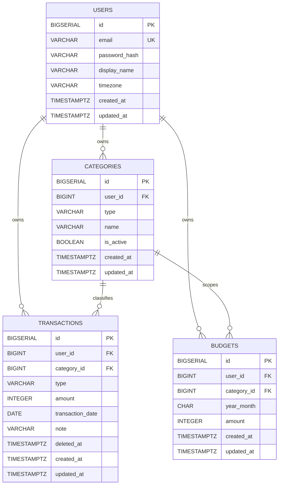

# ER Diagram

```mermaid
erDiagram
    USERS ||--o{ CATEGORIES : owns
    USERS ||--o{ TRANSACTIONS : owns
    USERS ||--o{ BUDGETS : owns
    CATEGORIES ||--o{ TRANSACTIONS : classifies
    CATEGORIES ||--o{ BUDGETS : scopes

    USERS {
        BIGSERIAL id PK
        VARCHAR email UK
        VARCHAR password_hash
        VARCHAR display_name
        VARCHAR timezone
        TIMESTAMPTZ created_at
        TIMESTAMPTZ updated_at
    }

    CATEGORIES {
        BIGSERIAL id PK
        BIGINT user_id FK
        VARCHAR type
        VARCHAR name
        BOOLEAN is_active
        TIMESTAMPTZ created_at
        TIMESTAMPTZ updated_at
    }

    TRANSACTIONS {
        BIGSERIAL id PK
        BIGINT user_id FK
        BIGINT category_id FK
        VARCHAR type
        INTEGER amount
        DATE transaction_date
        VARCHAR note
        TIMESTAMPTZ deleted_at
        TIMESTAMPTZ created_at
        TIMESTAMPTZ updated_at
    }

    BUDGETS {
        BIGSERIAL id PK
        BIGINT user_id FK
        BIGINT category_id FK
        CHAR year_month
        INTEGER amount
        TIMESTAMPTZ created_at
        TIMESTAMPTZ updated_at
    }
```

## Notes

- `categories.user_id + type + lower(name)` は実装で一意制約にする。
- `transactions` は `deleted_at` により論理削除する。
- `budgets.category_id` は `NULL` を許容し、全体予算を表現できる。
